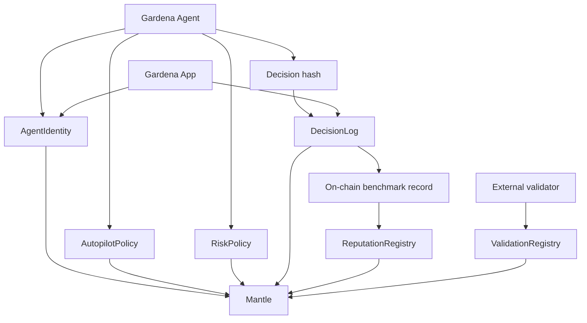
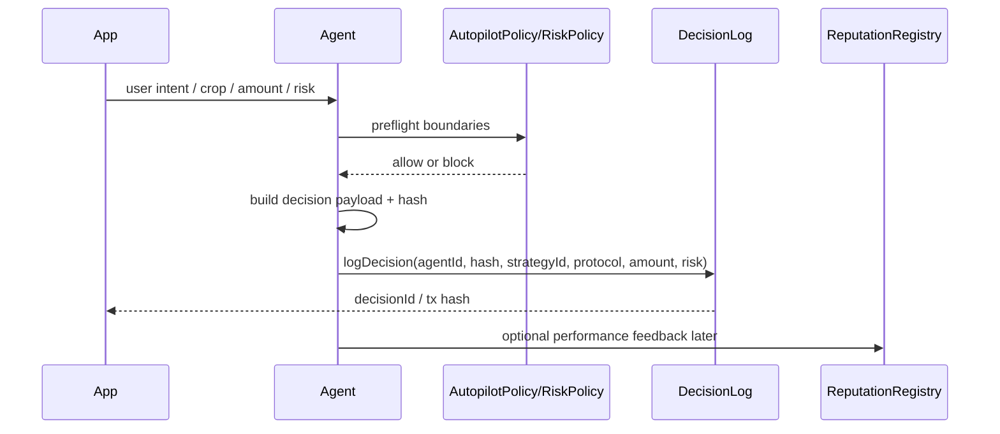

# Gardena Contracts

Solidity trust layer for **Gardena**, an AI x RWA yield garden on Mantle.

Current local path: `/root/projects/Gardenaz/contracts`

Standalone repo: `Gardenaz/contracts`

Gardena Contracts records agent identity, user risk boundaries, autopilot policy, decision hashes, validation responses, and reputation signals. This is the on-chain benchmark layer for Gardena agent performance.

## Track fit

- Primary: **AI x RWA** — policy and decision logs for USDY/mETH yield strategies.
- Secondary: **Consumer & Viral DApps** — verifiable proof data for shareable harvest cards and AI Farmer Diary.
- Required hackathon feature: **ERC-8004 agent identity** — every agent can have identity, reputation, and validation records.
- Required hackathon feature: **on-chain benchmarking** — every decision/outcome can be recorded on Mantle.

## Project boundary

This repo owns smart-contract concerns only:

- Solidity contracts.
- Foundry config.
- contract tests.
- deployment scripts.
- ABI/artifact output for App and Agent.

It does not own:

- web UI — see `Gardenaz/app`.
- LangGraph agent code — see `Gardenaz/agent`.
- Bybit/CEX API integrations.
- live protocol strategy adapters.

## Stack

- Solidity 0.8.24
- Foundry

## Contracts

### AgentIdentity

Path: `contracts/AgentIdentity.sol`

Role:

- ERC-8004-style agent identity registry.
- registers `agentId`, owner, name, metadata URI, and agent wallet.
- supports owner/operator/approved authorization checks.

### ReputationRegistry

Path: `contracts/ReputationRegistry.sol`

Role:

- stores feedback for agent performance.
- supports score/value, tags, endpoint, feedback URI/hash.
- allows authorized agent owner/operator response.

### ValidationRegistry

Path: `contracts/ValidationRegistry.sol`

Role:

- stores validation requests and responses.
- lets validators attach score, response URI/hash, and tag.
- supports external audit flow for agent decisions.

### AutopilotPolicy

Path: `contracts/AutopilotPolicy.sol`

Role:

- stores user autopilot boundaries.
- tracks max tx amount, max daily loss, max risk level, rebalance interval, allowlisted protocols, and emergency pause.
- exposes `canExecute()` for preflight checks.

### RiskPolicy

Path: `contracts/RiskPolicy.sol`

Role:

- stores or validates basic risk constraints.
- used as broader policy source for Agent/App safety checks.

### GardenUsdMock

Path: `contracts/GardenUsdMock.sol`

Role:

- settlement token for testing and controlled deployments.
- supports faucet, mint, and burn for vault flows.

### GardenStrategyAssetMock

Path: `contracts/GardenStrategyAssetMock.sol`

Role:

- route asset token used by the vault as underlying holdings.
- supports owner-approved minters so the vault can mint/burn the held route asset.

### GardenRwaMockVault

Path: `contracts/GardenRwaMockVault.sol`

Role:

- user-owned vault positions with operator authorization.
- `plant()` deposits gUSD, burns settlement, and mints route asset holdings into the vault.
- `harvest()` burns route asset holdings and mints settled gUSD back to the owner.
- `rebalance()` rotates a position into a different route when policy and authorization allow.

### DecisionLog

Path: `contracts/DecisionLog.sol`

Role:

- anchors agent decision hashes.
- records strategy id, target protocol, amount, risk level, outcome, and timestamp.
- emits `DecisionLogged` and `OutcomeUpdated` events for benchmarking.

## Architecture



<details>
<summary>ASCII version</summary>

```text
Gardena Agent
  |-- AgentIdentity      -> ERC-8004-style agent ID
  |-- AutopilotPolicy    -> user boundaries
  |-- RiskPolicy         -> guardrails
  |-- DecisionLog        -> decision/outcome benchmark
  |-- ReputationRegistry -> performance feedback
  +-- ValidationRegistry -> external validation

Gardena App reads/logs proof data for user-facing diary/share cards.
```
</details>

## Decision benchmark flow



## Key files

- `contracts/AgentIdentity.sol`
- `contracts/ReputationRegistry.sol`
- `contracts/ValidationRegistry.sol`
- `contracts/AutopilotPolicy.sol`
- `contracts/RiskPolicy.sol`
- `contracts/DecisionLog.sol`
- `test/ERC8004AndAutopilot.t.sol`
- `test/Starter.t.sol`
- `script/Deploy.s.sol`
- `foundry.toml`
- `package.json`

## Agent card URI

Final ERC-8004 agent metadata URI:

```text
ipfs://bafkreica6vuhzakepbjntfjqhddmjh6vicpgcep2a657xfwtjkgb56kvxu
```

Gateway preview:

```text
https://ipfs.io/ipfs/bafkreica6vuhzakepbjntfjqhddmjh6vicpgcep2a657xfwtjkgb56kvxu
```

Register command:

```bash
cast send "$AGENT_IDENTITY" \
  "registerAgent(string,string,address)" \
  "Gardena Autopilot" \
  "ipfs://bafkreica6vuhzakepbjntfjqhddmjh6vicpgcep2a657xfwtjkgb56kvxu" \
  "$AGENT_WALLET" \
  --rpc-url "$RPC_URL" \
  --private-key "$PRIVATE_KEY"
```

## Environment

```bash
MANTLE_RPC_URL=
PRIVATE_KEY=
```

After deployment, share addresses with App and Agent:

```bash
AGENT_IDENTITY_ADDRESS=
DECISION_LOG_ADDRESS=
RISK_POLICY_ADDRESS=
REPUTATION_REGISTRY_ADDRESS=
VALIDATION_REGISTRY_ADDRESS=
AUTOPILOT_POLICY_ADDRESS=
GARDEN_USD_MOCK_ADDRESS=
GARDEN_RWA_MOCK_VAULT_ADDRESS=
STEADY_ASSET_ADDRESS=
GROWTH_ASSET_ADDRESS=
BOOST_ASSET_ADDRESS=
```

## Development

```bash
forge build
forge test -vv
```

Package scripts:

```json
{
  "build": "forge build",
  "test": "forge test -vv",
  "verify": "bash script/VerifyMantleSepolia.sh"
}
```

## Deployment

```bash
export STABLE_FEED_ADDRESS=...
export GROWTH_FEED_ADDRESS=...
export BOOST_FEED_ADDRESS=...
forge script script/Deploy.s.sol:DeployScript --rpc-url $MANTLE_RPC_URL --private-key $PRIVATE_KEY --broadcast --verify --etherscan-api-key $ETHERSCAN_API_KEY
```

That single script now deploys:

- `AgentIdentity`
- `DecisionLog`
- `RiskPolicy`
- `ReputationRegistry`
- `ValidationRegistry`
- `AutopilotPolicy`
- `GardenUsdMock`
- `GardenStrategyAssetMock` route holdings for `steady`, `growth`, and `boost`
- `GardenRwaMockVault`
- direct Chainlink feed routes for `steady`, `growth`, and `boost`

The default live feeds are:

- `STABLE_FEED_ADDRESS` defaults to Mantle `USDC / USD`
- `GROWTH_FEED_ADDRESS` defaults to Mantle `ETH / USD`
- `BOOST_FEED_ADDRESS` defaults to Mantle `mETH / USD`

## Verification

Fast path from WSL:

```bash
cd /mnt/e/web3/gardenaz/contracts
export MANTLE_RPC_URL=...
export ETHERSCAN_API_KEY=...
npm run verify
```

The script verifies:

- `AgentIdentity`
- `DecisionLog`
- `RiskPolicy`
- `AutopilotPolicy`
- `ReputationRegistry`
- `ValidationRegistry`
- `GardenUsdMock`
- `GardenStrategyAssetMock` for steady, growth, and boost
- `GardenRwaMockVault`

It defaults to the latest deployed addresses in this repo, but you can override any of them with env vars:

```bash
export AGENT_IDENTITY_ADDRESS=...
export DECISION_LOG_ADDRESS=...
export RISK_POLICY_ADDRESS=...
export REPUTATION_REGISTRY_ADDRESS=...
export VALIDATION_REGISTRY_ADDRESS=...
export AUTOPILOT_POLICY_ADDRESS=...
export GARDEN_USD_MOCK_ADDRESS=...
export GARDEN_RWA_MOCK_VAULT_ADDRESS=...
export STEADY_ASSET_ADDRESS=...
export GROWTH_ASSET_ADDRESS=...
export BOOST_ASSET_ADDRESS=...
```

## Current execution status

Implemented:

- ERC-8004-style agent identity.
- reputation registry.
- validation registry.
- autopilot policy boundaries.
- decision hash logging.
- outcome update hook.
- user-owned vault with operator-managed route asset holdings.
- deployment and verification scripts for core contracts and route assets.
- Foundry tests for ERC-8004 + autopilot policy.

Not implemented yet:

- production deployment addresses.
- verified explorer links.
- live strategy vault integrations outside the local route-asset model.
- Bybit API support; not part of current AI x RWA core.
