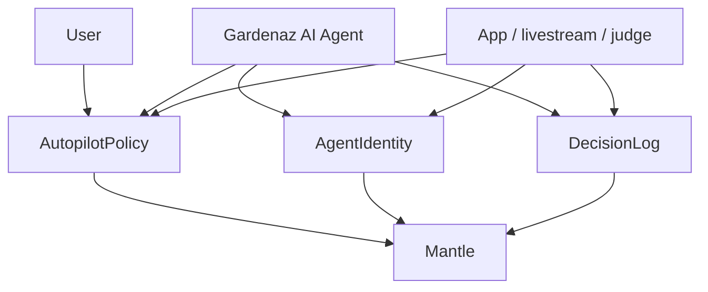

# Gardenaz Contracts

Solidity trust layer for Gardenaz on Mantle.

This package no longer models a mock vault or mock DeFi routes. It preserves the smallest on-chain surface that still matters for the hackathon thesis:

- on-chain benchmarking of AI decisions and outcomes on Mantle
- ERC-8004-style agent identity as an on-chain identity NFT
- radical transparency through live-proof-friendly event logs and verifiable policy state

## Product role

Gardenaz is an AI x RWA experience for beginner-friendly DeFi guidance around assets such as USDY and mETH on Mantle. The app and agent can evolve toward direct Agni execution, while this contracts package remains the trust layer that proves who the agent is, what guardrails the user set, and what the agent decided.

## Retained contracts

### AgentIdentity

Path: `contracts/AgentIdentity.sol`

Role:

- ERC-8004-style identity NFT for each participating AI agent
- stores owner, metadata URI, agent wallet metadata, active flag, and reputation slot
- gives the ecosystem a persistent on-chain identity record for benchmarking and reputation

### AutopilotPolicy

Path: `contracts/AutopilotPolicy.sol`

Role:

- deterministic user guardrails for automated execution
- stores max size, loss budget, risk ceiling, cadence, protocol allowlist, executor allowlist, and strategy allowlist
- provides the policy state that can be surfaced as live proof during AI execution

### DecisionLog

Path: `contracts/DecisionLog.sol`

Role:

- records decision hashes and finalized outcomes on Mantle
- anchors the benchmark trail for AI actions, execution results, and operator accountability
- keeps proof data simple enough to stream, inspect, and audit in real time

## Hackathon invariants

### On-chain benchmarking

Every retained contract exists to support benchmarkable AI behavior:

- `AgentIdentity` identifies the agent
- `AutopilotPolicy` shows the user-approved execution envelope
- `DecisionLog` records the decision and outcome trail

This is the core benchmark record that can be queried on Mantle and compared across agents.

### ERC-8004 agent identity

Gardenaz keeps ERC-8004-style identity as a first-class primitive. Every AI agent can be represented by a unique NFT-backed identity record with wallet metadata and URI-based profile data.

### Radical transparency

Gardenaz keeps proof-friendly contracts so the AI lifecycle can be observed publicly:

- decisions are emitted on-chain
- outcomes are finalized on-chain
- policy state is readable on-chain

The intended product framing is live proof, not black-box automation.

## Architecture



<details>
<summary>ASCII version</summary>

```text
Gardenaz AI Agent
  |-- AgentIdentity   -> ERC-8004-style identity NFT
  |-- AutopilotPolicy -> user guardrails
  +-- DecisionLog     -> decision and outcome benchmark trail

App, judges, and livestream surfaces read the same on-chain proof on Mantle.
```
</details>

## Deployment artifact

`deployments/mantle-sepolia.json` is intentionally small. It contains:

- retained contract addresses
- retained contract ABIs used by the app and agent
- optional agent registration metadata for the ERC-8004 identity record

## Environment

```bash
MANTLE_RPC_URL=
PRIVATE_KEY=
ETHERSCAN_API_KEY=
AGENT_IDENTITY_ADDRESS=
DECISION_LOG_ADDRESS=
AUTOPILOT_POLICY_ADDRESS=
```

## Development

```bash
forge build
forge test -vv
```

Package scripts:

```json
{
  "build": "forge build",
  "test": "forge test -vv",
  "verify": "bash script/VerifyMantleSepolia.sh"
}
```

## Deployment

```bash
forge script script/Deploy.s.sol:DeployScript \
  --rpc-url "$MANTLE_RPC_URL" \
  --private-key "$PRIVATE_KEY" \
  --broadcast \
  --verify \
  --etherscan-api-key "$ETHERSCAN_API_KEY"
```

The deploy script now deploys only:

- `AgentIdentity`
- `DecisionLog`
- `AutopilotPolicy`

## Verification

```bash
cd /mnt/e/web3/gardenaz/contracts
npm run verify
```

The verification script submits verification for only:

- `AgentIdentity`
- `DecisionLog`
- `AutopilotPolicy`

## Current execution status

Implemented:

- ERC-8004-style identity NFT
- user-configurable deterministic guardrails
- decision and outcome benchmarking on Mantle
- proof surfaces suitable for radical transparency and live review

Removed in this code cut:

- mock settlement token
- mock vault custody flow
- mock DeFi adapters
- duplicate risk and registry contracts that are no longer part of the Agni-first trust layer
